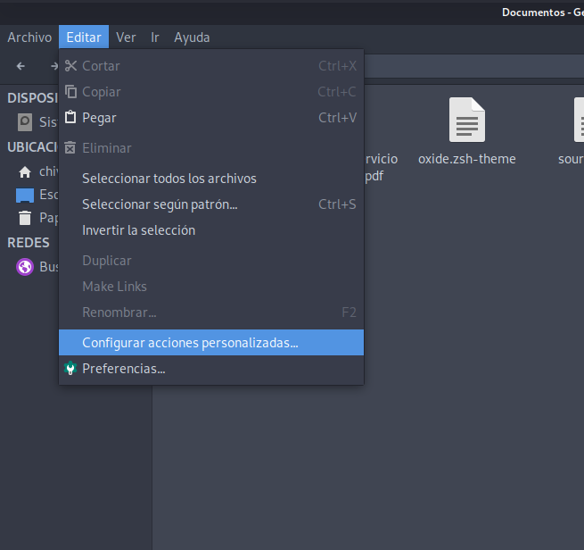
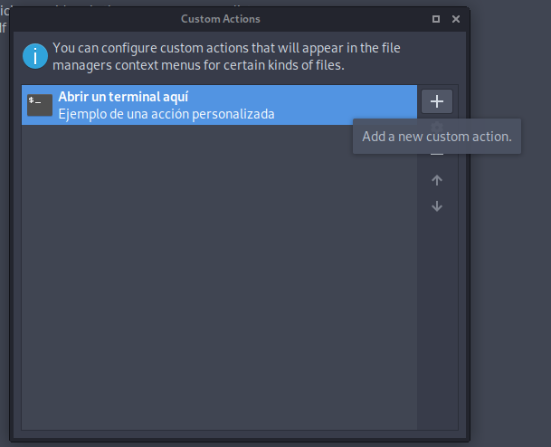
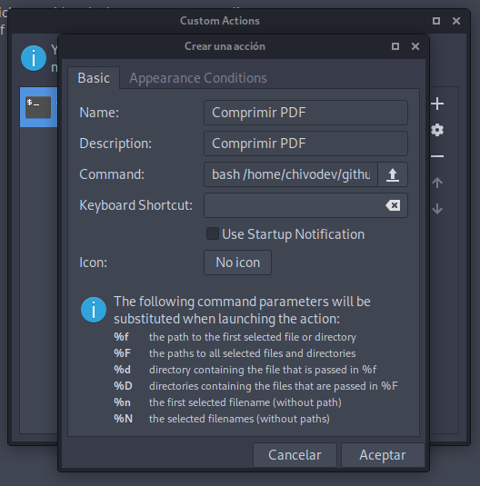
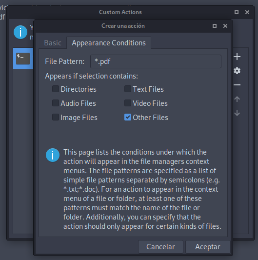

# comprimirPDF

Script Bash para comprimir archivos con gestor de archivos Thunar, de forma rapida y sencilla
Tambien pueden crear un alias para usarlo en cualquier Entorno de Escritorio Linux, al final mostrare como crear el alias.

## Instalar los paquetes necesarios para ejecutar el script
Para poder reducir los archivos pdf es necesario tener instalado los paquetes de zenity y ghostscript. En el entorno
de escritorio [xfce](https://www.xfce.org/)

### Aqui algunos comandos para instalar de acuerdo a cada distribucion que usen

#### Si usan Debian o derivados
	$ sudo apt-get install zenity ghostscript

#### Si usan Fedora o derivados
	$ sudo dnf install zenity ghostscript

#### Para usuario de OpenSuse
	$ sudo zypper in zenity ghostscript

#### Para aquellos que usan Arch o derivados
	$ sudo pacman -Sy zenity ghostscript

## Aqui crearemos el script
Una vez instalado los paquetes necesarios, procedemos a seguir los pasos a continuación.

1. Creamos la carpeta ejecutando el siguiente comando

		$ mkdir ~/config/Thunar/customScripts

2. A continuacion creamos el archivo donde pegar el codigo

		$ nano ~/config/Thunar/customScripts/comprimirPDF.sh

3. Luego que se abra el editor pegan el codigo del script **comprimirPDF.sh**, alli encontraras cada linea documentada

4. Luego de pegada (ctrl + shift + v) la informacion, guardamos ( ctrl + o ), y cerramos ( ctrl + x ) el editor

5. Ahora otorgamos permisos de ejecucion al script

		$ sudo chmod +x ~/config/Thunar/customScripts/comprimirPDF.sh

# Creamos la accion personalizada en gestor de archivos Thunar
Ahora procedemos con los pasos para crear un accion personalizada en Thunar.
Para ellos abrimos el gestor de archivos Thunar.

1. Damos click en Editar y luego en Configurar acciones personalizadas...

	

2. En la ventana que se abre damos click en el icono de + para agremar una accion

	

3. Ventana para crear la accion

	- En los campos de Nombre, Descripcion e Icono, pueden poder lo que deseen.

	- En el campo de orden, debe escribir la ruta donde esta el script

		bash /home/{USER}/.config/Thunar/customScripts/comprimirPDF.sh %n

	

	*__Nota: Deben cambiar {USER} por el nombre de usuario de la maquina.__*
	*__Nota: La ruta del script debe finalizar con %n para que pueda enviar como variable el archivo seleccionado.__*

	- En la pestaña de Condiciones de aparición, deben poner lo siguiente.

	- El File pattern o Patron de archivo, deben poner tal como se ve en la imagen, para que solo se muestre en archivos pdf al darles click derecho.

	- Damos click en Aceptar.

	

# Comentario acerca del script

Cabe aclarar que el codigo se pude usar para cualquier entorno de escritorio.

Para compresion de archivos por lotes, seguir los mismos pasos mencionado anteriormente.

En varias pruebas realizadas he tenido buenos resultados, algunos muy optimos, unos pocos no tan optimos, pero eso lo he visto en otros programas de
reduccion de calidad en archivos PDF's.

A continuacion mostrare una tabla de compatibilidades, donde pueden cambiar el Nivel de compatibilidad.

| Acrobat >= 4.0 | Acrobat >= 5.0 | Acrobat >= 6.0 | Acrobat >= 7.0 | 8.0 >= Acrobat <= 9.0 |
| :-------: | :-------: | :-------: | :-------: | :-------: |
| -dCompatibilityLevel=1.3 | -dCompatibilityLevel=1.4 | -dCompatibilityLevel=1.5 | -dCompatibilityLevel=1.6 | -dCompatibilityLevel=1.7 |

# Creando alias para usar el script por comando

Lo primero que haremos sera abrir .bashrc con el editor nano

	$ sudo nano ~/.bashrc

Al final de este crearemos el alias indicando la ruta de cada script

	alias comprimirPDF='bash ~/.config/Thunar/customScripts/comprimirPDF.sh'
	alias comprimirLotesPDF='bash ~/.config/Thunar/customScripts/comprimirLotesPDF.sh'

Recargamos el .bashrc

	$ source ~/.bashrc

Y ahora lo unico que debemos hacer es ir al directorio con el/los archivos pdf desde la terminal, y ejecutar el script

	$ cd /path/to/filesPDF

Este comando para archivo unico

	$ comprimirPDF nombrePDF.pdf

Este comando para multiples archivos

	$ comprimirLotesPDF